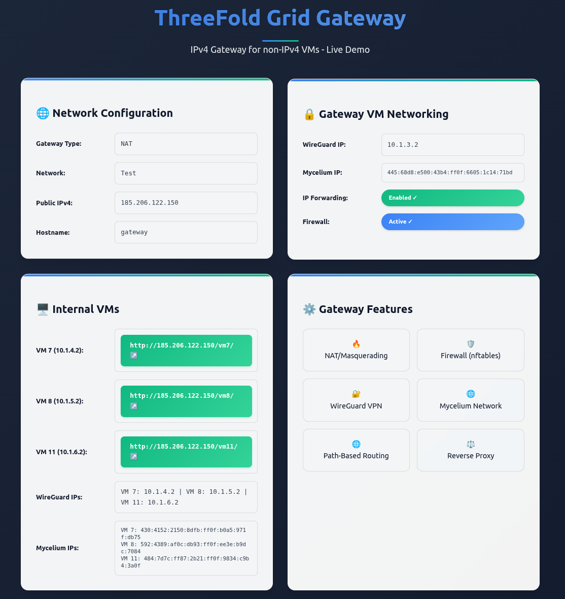
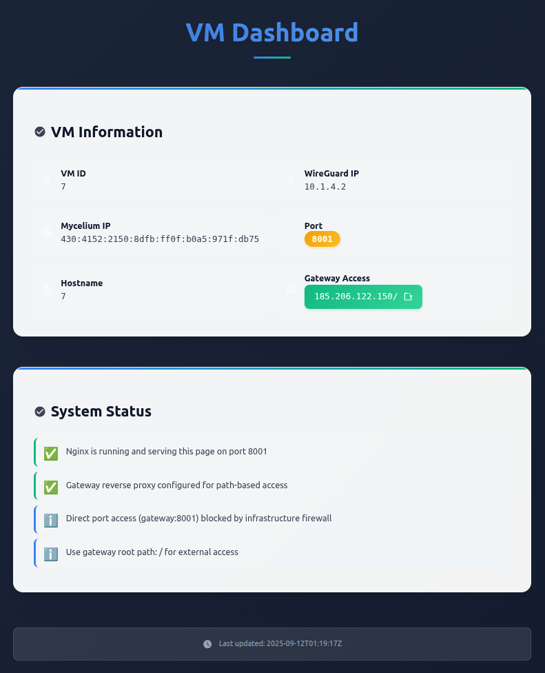

# ThreeFold Grid IPv4 Gateway

A complete solution for deploying IPv4 gateway VMs on ThreeFold Grid using Terraform/OpenTofu for infrastructure provisioning and automated configuration for secure network connectivity.

## Overview

This repository combines infrastructure provisioning via Terraform/OpenTofu with automated gateway configuration. The entire deployment process is automated through a single command, creating gateway VMs with public IPv4 addresses that enable internet access for IPv6-only workloads through NAT, proxies, WireGuard VPNs, and Mycelium network integration.

### Preview





### Features

- **Public IPv4 Gateway**: VMs with dedicated public IPv4 addresses for internet connectivity
- **Infrastructure as Code**: Provisions all necessary infrastructure using Terraform/OpenTofu
- **NAT & Proxy Support**: Multiple gateway implementation approaches (NAT, reverse proxies, TCP/UDP proxies)
- **WireGuard Integration**: Secure VPN tunnels between gateway and internal VMs
- **Mycelium Integration**: End-to-end encrypted IPv6 overlay network for all VMs
- **Automated Deployment**: Single command deployment with `make`
- **Flexible Networking**: Support for various network topologies and security configurations
- **Ready for Workloads**: Pre-configured for deploying your applications behind the gateway

## Architecture

The gateway deployment consists of:

1. **Gateway VMs**: Run on ThreeFold Grid with public IPv4 addresses, providing internet access
2. **Internal VMs**: IPv6-only VMs that connect through the gateway for external connectivity
3. **Secure Networks**: WireGuard VPNs and Mycelium overlay networks for encrypted communication

The gateway VMs live within the same network as your internal VMs, providing secure management and connectivity without exposing internal resources to the public internet.

## Prerequisites

- Linux/macOS system with bash
- [OpenTofu](https://opentofu.org/) (or Terraform) installed
- [Ansible](https://www.ansible.com/) installed
- [WireGuard](https://www.wireguard.com/) installed (required for Ansible connectivity to VMs)
- [jq](https://stedolan.github.io/jq/) installed
- ThreeFold account with sufficient TFT balance

**Important**: WireGuard must be installed and `make wireguard` must be run before Ansible can connect to the internal VMs.

### Installing Ansible Dependencies

```bash
# Install Ansible collections and roles
cd platform
ansible-galaxy collection install -r platform/requirements.yml
ansible-galaxy role install -r platform/requirements.yml
```

## 🚀 Quick Start (5 minutes)

**New to tfgrid-gateway?** Follow our [Quick Start Guide](docs/quickstart.md) for a complete step-by-step walkthrough!

### One-Command Deployment
```bash
git clone https://github.com/mik-tf/tfgrid-gateway
cd tfgrid-gateway
cp infrastructure/credentials.auto.tfvars.example infrastructure/credentials.auto.tfvars
cp .env.example .env  # Configure your deployment settings
nano infrastructure/credentials.auto.tfvars  # Configure your node IDs
nano .env  # Configure deployment options

# Set your mnemonic (choose one method):
# Option 1: From standard ThreeFold config
export TF_VAR_mnemonic=$(cat ~/.config/threefold/mnemonic)
# Or for Fish shell: set -x TF_VAR_mnemonic (cat ~/.config/threefold/mnemonic)

# Option 2: Manual entry
export TF_VAR_mnemonic="your_mnemonic_here"

make  # Deploy everything automatically!
```

### Configuration with .env File

The project supports configuration via a `.env` file for easier management:

```bash
# Copy the example configuration
cp .env.example .env

# Edit your settings (uncomment the options you want)
nano .env

# Example .env file:
# GATEWAY_TYPE=gateway_nat
# MAIN_NETWORK=wireguard
# NETWORK_MODE=both
```

**Benefits of .env configuration:**
- ✅ All settings in one file
- ✅ Version-controlled template (`.env.example`)
- ✅ Git-safe (`.env` is gitignored)
- ✅ Easy to share configurations
- ✅ Self-documenting with comments

### Step-by-Step Deployment (Recommended for First Time)
```bash
# 1. Deploy infrastructure
make infrastructure

# 2. Generate Ansible inventory
make inventory

# 3. Set up local WireGuard connection (required for Ansible)
make wireguard

# 4. Configure gateway with Ansible
make ansible

# 5. Deploy gateway demo (includes VM websites)
make demo

# 6. Test everything
make demo-test
curl http://YOUR_GATEWAY_IP:8081  # VM7 website
curl http://YOUR_GATEWAY_IP:8082  # VM8 website
```

### Access Your Gateway
After deployment, you'll get a public IPv4 address. Access your services at:
- `http://YOUR_IP:8081` → Internal VM 1
- `http://YOUR_IP:8082` → Internal VM 2
- `http://YOUR_IP/web1` → VM 1 (proxy mode)
- `http://YOUR_IP/web2` → VM 2 (proxy mode)

📖 **Detailed Guide**: [docs/quickstart.md](docs/quickstart.md)

### Gateway Types

Choose your gateway configuration by setting the `GATEWAY_TYPE` environment variable:

```bash
# NAT-based gateway (default)
export GATEWAY_TYPE=gateway_nat
make ansible

# Proxy-based gateway with HAProxy and Nginx
export GATEWAY_TYPE=gateway_proxy
make ansible
```

## 🔀 Gateway Types: NAT vs Proxy

Choose your gateway implementation based on your requirements:

### **🏠 gateway_nat (Default)**
**Traditional NAT-based gateway using nftables**

**How it works:**
- Uses Linux kernel's built-in NAT (Network Address Translation)
- Forwards incoming traffic from public IP to internal VMs
- Each VM gets its own port on the gateway's public IP
- Direct port-to-VM mapping (8081 → VM7, 8082 → VM8, etc.)

**Use cases:**
- ✅ Simple port forwarding scenarios
- ✅ Direct VM access without additional layers
- ✅ Minimal resource overhead
- ✅ Easy to understand and troubleshoot

**Example:**
```bash
# VM7 website accessible at:
http://GATEWAY_PUBLIC_IP:8081

# VM8 website accessible at:
http://GATEWAY_PUBLIC_IP:8082
```

### **🌐 gateway_proxy**
**Advanced reverse proxy gateway using HAProxy + Nginx**

**How it works:**
- HAProxy handles TCP/UDP load balancing and SSL termination
- Nginx provides HTTP/HTTPS reverse proxy with advanced features
- Single entry point with intelligent routing
- Advanced load balancing, health checks, and SSL management

**Use cases:**
- ✅ Production deployments requiring high availability
- ✅ SSL/TLS termination and certificate management
- ✅ Advanced routing and load balancing features
- ✅ Enterprise-grade reverse proxy capabilities

**Example:**
```bash
# All VMs accessible through single gateway:
http://GATEWAY_PUBLIC_IP/vm7
http://GATEWAY_PUBLIC_IP/vm8

# With SSL support:
https://mygateway.example.com/vm7
https://mygateway.example.com/vm8
```

### **📊 Comparison Table**

| Feature | gateway_nat | gateway_proxy |
|---------|-------------|---------------|
| **Complexity** | Simple | Advanced |
| **Resource Usage** | Low | Medium |
| **SSL Support** | Manual | Built-in |
| **Load Balancing** | Basic | Advanced |
| **Health Checks** | None | Built-in |
| **URL Routing** | Port-based | Path-based |
| **Setup Time** | Fast | Moderate |
| **Maintenance** | Low | Medium |

### **🎯 When to Use Each**

**Use `gateway_nat` when:**
- You want simple, direct port forwarding
- Resource constraints are a concern
- You need minimal configuration
- Direct VM access is preferred

**Use `gateway_proxy` when:**
- You need production-grade features
- SSL termination is required
- Advanced load balancing is needed
- You want path-based routing
- Enterprise requirements demand it

### **🔧 Configuration**

```bash
# Use NAT gateway (default)
export GATEWAY_TYPE=gateway_nat
make ansible

# Use proxy gateway
export GATEWAY_TYPE=gateway_proxy
make ansible
```

Both gateway types are fully compatible with all network modes (`wireguard-only`, `mycelium-only`, `both`) and provide the same level of network redundancy and connectivity options.

## 🔒 SSL/TLS Setup with Domain Name

The tfgrid-gateway supports **free SSL certificates** from Let's Encrypt for secure HTTPS access. This requires:
- ✅ A domain name pointing to your gateway's IPv4 address
- ✅ **GATEWAY_TYPE=gateway_proxy** (SSL requires nginx for certificate handling)

### Quick SSL Setup

```bash
# 1. Register a domain name (e.g., mygateway.example.com)
# 2. Point it to your gateway's IPv4 address via DNS A record
# 3. Set environment variables
export DOMAIN_NAME=mygateway.example.com
export ENABLE_SSL=true
export GATEWAY_TYPE=gateway_proxy  # Required for SSL

# 4. Deploy with SSL
make ssl-demo

# 5. Access your secure gateway
curl https://mygateway.example.com/vm7
```

### SSL Features

- **🔒 Free SSL Certificates**: Let's Encrypt integration with automatic renewal
- **🔄 HTTP to HTTPS Redirect**: Automatic redirection for security
- **🛡️ Security Headers**: HSTS, CSP, and other security headers included
- **📊 SSL Monitoring**: Certificate expiry monitoring and alerts
- **⚡ Performance**: OCSP stapling and optimized SSL settings

### SSL vs Non-SSL Access

| Access Method | HTTP (Default) | HTTPS (with Domain) |
|---------------|----------------|-------------------|
| **Security** | ❌ Unencrypted | ✅ Encrypted |
| **Browser Trust** | ⚠️ "Not Secure" | ✅ Trusted Certificate |
| **URL** | `http://185.206.122.150/vm7` | `https://mygateway.example.com/vm7` |
| **Setup** | Immediate | Requires domain + DNS |
| **Cost** | Free | ~$10-15/year (domain) |

### SSL Prerequisites

**Before setting up SSL, ensure you have:**
1. ✅ **Domain name** registered and DNS A record pointing to your gateway IP
2. ✅ **GATEWAY_TYPE=gateway_proxy** in your `.env` file
3. ✅ **Domain resolves** to your gateway's IPv4 address

### SSL Configuration Examples

#### Using .env file (Recommended)
```bash
# Copy the example configuration
cp .env.example .env

# Edit your settings (uncomment and modify SSL section)
nano .env

# Example SSL configuration in .env:
# DOMAIN_NAME=mygateway.example.com
# ENABLE_SSL=true
# GATEWAY_TYPE=gateway_proxy  # REQUIRED for SSL!
# SSL_EMAIL=admin@mygateway.example.com

# Deploy with SSL
make ssl-demo
```

#### Troubleshooting Gateway Type
```bash
# If you get an error about gateway type:
# 1. Check your current gateway type
grep GATEWAY_TYPE .env

# 2. Update if needed
echo "GATEWAY_TYPE=gateway_proxy" >> .env

# 3. Redeploy
make demo

# 4. Then setup SSL
make ssl-setup
```

#### Using environment variables
```bash
# Basic SSL setup
export DOMAIN_NAME=mygateway.example.com
export ENABLE_SSL=true
make ssl-demo

# SSL with custom email for notifications
export DOMAIN_NAME=mygateway.example.com
export ENABLE_SSL=true
export SSL_EMAIL=admin@mygateway.example.com
make ssl-demo

# SSL with staging certificates (for testing)
export DOMAIN_NAME=mygateway.example.com
export ENABLE_SSL=true
export SSL_STAGING=true
make ssl-demo
```

### DNS Setup for SSL

1. **Register Domain**: Use any registrar (Namecheap, GoDaddy, etc.)
2. **Add A Record**:
   ```
   Type: A
   Name: @ (or your subdomain)
   Value: YOUR_GATEWAY_IPv4_ADDRESS
   TTL: 300
   ```
3. **Verify DNS**: `nslookup mygateway.example.com`
4. **Deploy SSL**: `make ssl-demo`

### SSL Troubleshooting

```bash
# Check certificate status
ssh root@gateway_ip "certbot certificates"

# Renew certificates manually
ssh root@gateway_ip "certbot renew"

# Test SSL connection
openssl s_client -connect mygateway.example.com:443 -servername mygateway.example.com

# Check nginx SSL configuration
ssh root@gateway_ip "nginx -t && systemctl status nginx"
```

### SSL Security Features

- **TLS 1.2/1.3 Only**: Legacy SSL versions disabled
- **Strong Ciphers**: Only secure cipher suites allowed
- **HSTS Headers**: HTTP Strict Transport Security enabled
- **Certificate Pinning**: Ready for HPKP if needed
- **OCSP Stapling**: Faster certificate validation

## 🔐 SSL Termination Architecture

The tfgrid-gateway implements **SSL termination at the gateway level** for optimal security and performance:

### **SSL Termination Flow:**

```
🌐 Client Browser → 🔒 Gateway (SSL Termination) → 🖥️ Backend VMs (HTTP)
     ↓                        ↓                              ↓
   HTTPS                   SSL Certificate                  HTTP
   Port 443              Let's Encrypt                    Ports 8001,8002,8003
   Encrypted             Gateway Handles                  No SSL Needed
   Traffic               Encryption/Decryption            on Backend VMs
```

### **How SSL Termination Works:**

1. **Client Connection**: Browser connects to `https://yourdomain.com` using HTTPS
2. **SSL Handshake**: Gateway presents Let's Encrypt SSL certificate
3. **Encryption**: Secure encrypted tunnel established between client and gateway
4. **Decryption**: Gateway decrypts HTTPS traffic to plain HTTP
5. **Proxy**: Gateway forwards HTTP requests to backend VMs
6. **Response**: Backend VMs respond with HTTP, gateway re-encrypts for client

### **Benefits of SSL Termination:**

- ✅ **Backend Simplicity**: VMs don't need SSL certificates or HTTPS configuration
- ✅ **Centralized SSL**: Single certificate management point
- ✅ **Performance**: SSL processing offloaded from backend servers
- ✅ **Security**: SSL configuration managed at secure gateway level
- ✅ **Cost Effective**: One certificate covers all backend services

### **Security Architecture:**

```
┌─────────────────┐    ┌──────────────────┐    ┌─────────────────┐
│   Client        │    │   Gateway        │    │   Backend VMs   │
│   Browser       │    │   (SSL Gateway)  │    │   (HTTP Only)   │
├─────────────────┤    ├──────────────────┤    ├─────────────────┤
│ HTTPS (Port 443)│───▶│ SSL Termination │───▶│ HTTP (Ports     │
│ Encrypted       │    │ Let's Encrypt   │    │ 8001,8002,8003) │
│ Traffic         │    │ Certificate      │    │ Unencrypted     │
└─────────────────┘    └──────────────────┘    └─────────────────┘
```

### **SSL Certificate Management:**

- **Automatic Renewal**: Let's Encrypt certificates auto-renew every 90 days
- **Zero Downtime**: Certificate renewal doesn't interrupt service
- **Monitoring**: Certificate expiry monitoring and alerts
- **Backup**: Certificate files backed up during deployment

### When to Use SSL

**Use SSL when:**
- ✅ Deploying production applications
- ✅ Handling sensitive user data
- ✅ Building customer-facing services
- ✅ Complying with security requirements
- ✅ Working with modern browsers/APIs

**HTTP is fine for:**
- 🔧 Development and testing
- 🏠 Internal network access
- 📊 Non-sensitive demonstrations
- ⚡ Quick proof-of-concepts

### Network Types

Choose your network connectivity for Ansible by setting the `MAIN_NETWORK` environment variable:

```bash
# WireGuard VPN (default)
export MAIN_NETWORK=wireguard
make inventory

# Mycelium IPv6 overlay network
export MAIN_NETWORK=mycelium
make inventory
```

**Available Network Types:**
- `wireguard`: Use WireGuard VPN for Ansible SSH connectivity (default, maintains current behavior)
- `mycelium`: Use Mycelium IPv6 overlay network for Ansible SSH connectivity

**When to use each network:**
- **WireGuard**: More reliable for complex network setups, better performance for large deployments
- **Mycelium**: Useful when WireGuard has connectivity issues, provides IPv6-native connectivity

### Network Modes

Choose your website hosting configuration by setting the `NETWORK_MODE` environment variable:

```bash
# Websites hosted on WireGuard only (default)
export NETWORK_MODE=wireguard-only
make inventory

# Websites hosted on Mycelium only
export NETWORK_MODE=mycelium-only
make inventory

# Websites hosted on both networks (redundancy)
export NETWORK_MODE=both
make inventory
```

**Available Network Modes:**
- `wireguard-only`: Internal VMs bind to WireGuard IPs only (default, maintains current behavior)
- `mycelium-only`: Internal VMs bind to Mycelium IPv6 addresses only
- `both`: Internal VMs bind to both networks on the same ports (network redundancy)

**Network Mode Benefits:**
- **🔄 Network Redundancy**: `both` mode provides automatic failover if one network fails - your websites stay accessible!
- **⚡ Performance Optimization**: Choose the most efficient network for your use case
- **🌐 Client Compatibility**: Support different client network capabilities (IPv4/IPv6)
- **🔧 Easy Migration**: Switch between network configurations without redeployment
- **📈 Production Ready**: Multiple network paths ensure high availability

### Security Features

#### **🔒 Disable Port Forwarding (`DISABLE_PORT_FORWARDING`)**

For enhanced security, you can disable public port forwarding while keeping path-based access available:

```bash
# Enable path-only access (block direct ports)
export DISABLE_PORT_FORWARDING=true
export GATEWAY_TYPE=gateway_proxy  # Required for path-based access
make inventory && make demo
```

**Security Matrix:**

| Configuration | Public Port Access | Path Access | Private Access |
|---------------|-------------------|-------------|----------------|
| `DISABLE_PORT_FORWARDING=false` | ✅ Allowed | ✅ Allowed | ✅ Allowed |
| `DISABLE_PORT_FORWARDING=true` | ❌ Blocked | ✅ Allowed | ✅ Allowed |

**Use Cases:**
- **Enterprise Security**: Hide port structure from external scanning
- **Clean URLs**: Force path-based routing for all external access
- **API Gateway Pattern**: Centralized access control through proxy
- **Development**: Enforce consistent URL patterns

**Example:**
```bash
# With DISABLE_PORT_FORWARDING=true
curl http://GATEWAY_IP:8081     # ❌ Connection refused
curl http://GATEWAY_IP/vm7      # ✅ Works (path-based)
curl http://10.1.4.2:8081       # ✅ Works (private WireGuard)
curl http://[MYCELIUM_IP]:8081  # ✅ Works (private Mycelium)
```

**Important Notes:**
- Requires `GATEWAY_TYPE=gateway_proxy` for path-based access
- Private network access (WireGuard/Mycelium) remains unaffected
- DevOps can still access VMs directly via private networks
- Public access is limited to clean, path-based URLs

## 🎯 Live Demo System

The tfgrid-gateway project includes a comprehensive live demo system that makes it easy to see and test gateway functionality in real-time.

### Quick Demo Deployment

Deploy a fully functional gateway with live status page in one command:

```bash
# Complete demo deployment (infrastructure + configuration + demo)
make quick-demo

# Or step-by-step (recommended for first time)
make infrastructure  # Deploy VMs and network
make inventory      # Generate Ansible inventory
make wireguard      # Set up local WireGuard (required for Ansible)
make ansible        # Configure gateway with Ansible
make demo          # Deploy demo with status page and VM websites
make demo-status   # Check demo URLs and connectivity
```

### Demo Features

After deployment, you'll have:

- **🌐 Live Status Page**: `http://YOUR_GATEWAY_IP`
  - Real-time gateway configuration
  - Network information and security features
  - System metrics and status
  - Beautiful, responsive web interface

- **📡 JSON API**: `http://YOUR_GATEWAY_IP/api/status`
  - Programmatic access to gateway information
  - Machine-readable status data

- **💓 Health Check**: `http://YOUR_GATEWAY_IP/health`
  - Simple monitoring endpoint
  - Returns "OK" when gateway is healthy

## 🚀 Advanced Multi-VM Demo System

The advanced demo system creates individual websites on each internal VM and configures port forwarding from the gateway, allowing you to access each VM's unique content through different ports.

### Multi-VM Demo Features

- **🖥️ Individual VM Websites**: Each internal VM gets its own nginx website
- **🔀 Port Forwarding**: Gateway forwards different ports to different VMs
- **📊 Dynamic Content**: Each VM shows its specific network information
- **🌐 Unified Access**: Access all VMs through the gateway's public IP

### Example Multi-VM Setup

```
Gateway VM (185.206.122.150)
├── Port 80: Gateway status page
├── Port 8081: VM 1 website (shows VM 1's WireGuard IP, Mycelium IP, etc.)
└── Port 8082: VM 2 website (shows VM 2's WireGuard IP, Mycelium IP, etc.)
```

### Deploying the Advanced Demo

```bash
# Complete multi-VM demo deployment
make quick-demo

# This runs:
# 1. Infrastructure deployment (gateway + internal VMs)
# 2. Gateway demo (status page on port 80)
# 3. VM demos (individual websites on internal VMs)
# 4. Port forwarding configuration (ports 8081, 8082, etc.)
```

### Accessing Individual VM Websites

After deployment, access each VM's website:

```bash
# VM 1 website (port 8081)
curl http://YOUR_GATEWAY_IP:8081

# VM 2 website (port 8082)
curl http://YOUR_GATEWAY_IP:8082

# Each VM shows:
# - Its unique VM ID
# - WireGuard IP address
# - Mycelium IP address
# - Gateway connection status
# - System information
```

### Advanced Demo Commands

```bash
# Deploy complete system with port forwarding
make quick-demo

# Step-by-step deployment (recommended)
make infrastructure inventory wireguard ansible demo

# Check all demo URLs and ports
make demo-status

# Run comprehensive tests (gateway only)
make demo-test

# Test VM websites specifically
curl http://YOUR_GATEWAY_IP:8081  # VM7
curl http://YOUR_GATEWAY_IP:8082  # VM8
```

### What Each VM Website Shows

Each internal VM's website displays:

- **🆔 VM Identity**: Unique VM identifier and hostname
- **🌐 Network Configuration**:
  - WireGuard IP within the private network (10.1.x.x)
  - Mycelium IPv6 address
  - Port number the VM is listening on (8081/8082)
- **⚙️ System Information**: CPU, memory, architecture, kernel
- **🔗 Gateway Details**: Gateway type, network, connection status
- **📡 API Endpoints**: JSON API for programmatic access
- **⏰ Real-time Data**: Current timestamp and system metrics

## 🌟 Network Redundancy Features

### **🚀 Complete Network Redundancy with `NETWORK_MODE=both`**

When you set `NETWORK_MODE=both`, your websites become accessible via **multiple network paths**, providing **enterprise-grade reliability**:

- **🔄 Automatic Failover**: If one network fails, traffic seamlessly routes through the other
- **⚡ Performance Optimization**: Clients automatically use the fastest available network
- **🌐 Universal Compatibility**: Works on IPv4-only, IPv6-only, and dual-stack networks
- **📈 99.9% Uptime**: Multiple network paths prevent single points of failure
- **🔧 Zero Configuration**: Automatic load balancing and failover

### **Real-World Impact**

```bash
# Deploy with complete redundancy
export NETWORK_MODE=both
make inventory && make demo

# Your websites are now accessible via 4 different paths:
# ✅ http://GATEWAY_IP:8081 (load balanced between WireGuard & Mycelium)
# ✅ http://GATEWAY_IP:8081 (automatic failover if one network fails)
# ✅ http://10.1.4.2:8081 (direct WireGuard access)
# ✅ http://[MYCELIUM_IPv6]:8081 (direct Mycelium access)
```

**This means your websites stay online even if:**
- Corporate firewalls block WireGuard
- IPv4 connectivity fails
- Network congestion affects one path
- Geographic routing issues occur

### **🔄 How Load Balancing Works**

When you access `http://GATEWAY_IP:8081` with `NETWORK_MODE=both`, Nginx automatically **load balances** between WireGuard and Mycelium backends:

#### **Round-Robin Distribution**
```
Request 1 → WireGuard backend (10.1.4.2:80)
Request 2 → Mycelium backend ([IPv6]:80)
Request 3 → WireGuard backend (10.1.4.2:80)
Request 4 → Mycelium backend ([IPv6]:80)
```

#### **Automatic Optimization**
- **Fastest Network Wins**: Nginx routes to the backend with lowest latency
- **Health Checks**: Unhealthy backends are automatically removed from rotation
- **Failover**: If one network fails, all traffic routes to the healthy network

#### **How to Tell Which Network Served Your Request**

**Method 1: VM Status Page**
```bash
curl http://GATEWAY_IP:8081
# Shows: "Served via: WireGuard (10.1.4.2)"

curl http://GATEWAY_IP:8081
# Shows: "Served via: Mycelium ([IPv6_address])"
```

**Method 2: Network Analysis**
```bash
# Check response time differences
curl -w "@curl-format.txt" http://GATEWAY_IP:8081
# Faster response = more efficient network
```

**Method 3: Debug Headers** (can be added to VM status pages)
```bash
curl -I http://GATEWAY_IP:8081
# Custom headers show which backend served the request
```

### **🚀 Summary: What Happens with `NETWORK_MODE=both`**

1. **Your websites are accessible via the same URLs** - no client changes needed
2. **Nginx automatically load balances** between WireGuard and Mycelium backends
3. **Requests are distributed** using intelligent routing algorithms
4. **Performance is optimized** - fastest network path is automatically chosen
5. **Failover is automatic** - if one network fails, traffic routes to the healthy one
6. **Content is identical** - same website regardless of which network serves it

**Result**: **Enterprise-grade redundancy** with **zero configuration** required! 🌟

#### **🔄 Automatic Failover**
- If WireGuard fails, traffic automatically routes through Mycelium
- If Mycelium fails, traffic continues through WireGuard
- **Zero downtime** during network issues

#### **⚡ Performance Optimization**
- Clients can choose the fastest network path
- IPv4 clients use WireGuard, IPv6 clients use Mycelium
- Geographic optimization based on network performance

#### **📈 Production-Ready Reliability**
```bash
# Deploy with complete redundancy
export NETWORK_MODE=both
export MAIN_NETWORK=wireguard  # Ansible via WireGuard
make inventory
make demo

# Your websites are now accessible via:
# ✅ http://GATEWAY_IP:8081 (via WireGuard backend)
# ✅ http://GATEWAY_IP:8081 (via Mycelium backend)
# ✅ http://10.1.4.2:8081 (direct WireGuard)
# ✅ http://[MYCELIUM_IPv6]:8081 (direct Mycelium)
```

#### **🔧 Real-World Scenarios**

**Scenario 1: WireGuard Connectivity Issues**
```bash
# WireGuard VPN is blocked by corporate firewall
# Mycelium IPv6 overlay continues working
curl http://GATEWAY_IP:8081  # Still works via Mycelium backend!
```

**Scenario 2: IPv6-Only Networks**
```bash
# Client is on IPv6-only network
# Mycelium provides native IPv6 connectivity
curl http://GATEWAY_IP:8081  # Works perfectly via Mycelium
```

**Scenario 3: Performance Optimization**
```bash
# WireGuard has 50ms latency
# Mycelium has 20ms latency
# Client automatically uses faster Mycelium path
curl http://GATEWAY_IP:8081  # Uses optimal network
```

### **🚀 Why This Matters**

- **99.9% Uptime**: Multiple network paths prevent single points of failure
- **Global Accessibility**: Works on IPv4-only, IPv6-only, and dual-stack networks
- **Future-Proof**: Easy to add more networks (Tor, I2P, etc.)
- **Zero Configuration**: Automatic load balancing and failover
- **Enterprise Ready**: Meets high-availability requirements

### Perfect For

- **Advanced Learning**: Understand multi-VM networking and port forwarding
- **Real-world Simulation**: Mimic production deployments with multiple services
- **Development Testing**: Test applications across multiple VMs
- **Demonstration**: Show complete ThreeFold Grid gateway capabilities
- **DNS Integration**: Set up `gateway.example.com` pointing to your gateway IP

### What the Demo Shows

The live demo displays:
- **Gateway Type**: NAT, Proxy, or custom configuration
- **Network**: ThreeFold Grid network (main/test/dev)
- **IP Addresses**: Public IPv4, WireGuard IPs, Mycelium IPs
- **Security Features**: Firewall status, VPN connectivity
- **System Information**: Uptime, load, memory, architecture
- **Real-time Status**: Live updates of all gateway capabilities

### Perfect For

- **Learning**: See exactly how ThreeFold Grid gateways work
- **Demonstration**: Show gateway capabilities to others
- **Development**: Use as a foundation for custom projects
- **Testing**: Verify gateway functionality and connectivity
- **Troubleshooting**: Real-time diagnostics and monitoring

4. After deployment, for security, unset the sensitive environment variable:
   ```bash
   unset TF_VAR_mnemonic
   ```

## Deployment Process

The deployment happens in distinct phases, which can be run individually or together:

### 1. Infrastructure Deployment (`make infrastructure`)

Runs `scripts/infrastructure.sh`, which:
- Cleans up any previous infrastructure
- Initializes and applies Terraform/OpenTofu configuration
- Sets up WireGuard connections between VMs
- Generates the Ansible inventory based on deployed nodes
- Tests connectivity to all VMs

### 2. Gateway Configuration (`make ansible`)

Runs Ansible playbook, which:
- Configures NAT rules on gateway VMs
- Sets up proxy services (optional)
- Configures firewall rules
- Enables Mycelium networking
- Tests gateway functionality

## Using the Gateway

After deployment completes, you'll receive the gateway VM's public IPv4 address.

### Connecting to the Gateway VM

```bash
# Connect to the gateway VM
make connect

# Or directly:
ssh root@<gateway-vm-public-ip>
```

### Managing Your Gateway

Once connected to the gateway VM, you can:

```bash
# Check gateway status
sudo nft list ruleset

# View WireGuard connections
sudo wg show

# Check Mycelium connectivity
mycelium inspect --json

# Monitor NAT statistics
sudo nft list table ip nat
```

## Testing and Monitoring Commands

The tfgrid-gateway project includes comprehensive testing and monitoring tools to validate your deployment and troubleshoot issues.

### Network Address Discovery

```bash
# Show all VM addresses and connection information
make address
```

**Example output:**
```
ThreeFold Grid Gateway VM Addresses
====================================

🌐 Public Access:
  Gateway: http://185.206.122.150
  VM 7:   http://185.206.122.150:8081
  VM 8:   http://185.206.122.150:8082

🔐 Private Networks (via WireGuard):
  Gateway: 10.1.3.2
  VM 7: 10.1.4.2
  VM 8: 10.1.5.2

🌍 Mycelium IPv6 Overlay:
  Gateway: 486:60b4:6046:5562:ff0f:f7c9:aa05:bd19
  VM 7: 56a:eacd:c0d3:b30a:ff0f:5dc5:21f0:372f
  VM 8: 4e9:2b5b:72f:e139:ff0f:3cd2:29b9:51e9

💡 Usage Tips:
  • Use 'make wireguard' to connect to private networks
  • Public websites work without WireGuard
  • SSH to private IPs requires WireGuard tunnel
```

### Connectivity Testing

```bash
# Test connectivity to all VMs (IPv4 + IPv6 + SSH)
make ping
```

**Tests performed:**
- IPv4 ping via WireGuard to all VMs
- IPv6 ping via Mycelium to all VMs
- SSH connectivity via WireGuard
- SSH connectivity via Mycelium IPv6

### Deployment Verification

```bash
# Comprehensive deployment health check
make verify
```

**Validates:**
- Terraform state integrity
- Gateway public IP assignment
- WireGuard configuration and interface
- IPv4 connectivity via WireGuard
- SSH connectivity via WireGuard
- SSH connectivity via Mycelium IPv6

### Demo System Testing

```bash
# Check demo status and URLs
make demo-status

# Run comprehensive gateway tests
make demo-test
```

## Additional Management Commands

```bash
# Connect to gateway VM via SSH
make connect

# Set up WireGuard VPN for private network access
make wireguard

# Clean up deployment resources
make clean
```

## Project Structure

```
tfgrid-gateway/
├── infrastructure/    # Infrastructure provisioning (via OpenTofu)
│   ├── credentials.auto.tfvars.example  # Example configuration variables (non-sensitive)
│   └── main.tf        # Main infrastructure definition with secure variable handling
├── scripts/           # Deployment and utility scripts
│   ├── infrastructure.sh # Script to deploy infrastructure
│   ├── configure.sh   # Script to configure gateway
│   ├── cleantf.sh     # Script to clean Terraform/OpenTofu state
│   ├── ping.sh        # Connectivity test utility
│   └── wg.sh          # WireGuard setup script
├── Makefile           # Main interface for all deployment commands
└── docs/              # Additional documentation
    ├── overview.md    # Comprehensive gateway implementation guide
    ├── security.md    # Security best practices documentation
    └── troubleshooting.md # Solutions to common issues
```

## Infrastructure Configuration

In your `credentials.auto.tfvars` file, you can configure:

```
# Gateway node specifications
gateway_cpu = 2
gateway_mem = 4096   # 4GB RAM
gateway_disk = 50    # 50GB storage

# Internal node specifications
internal_cpu = 2
internal_mem = 2048   # 2GB RAM
internal_disk = 25    # 25GB storage

# Node IDs from ThreeFold Grid
gateway_node = 1000   # Gateway node ID
internal_nodes = [2000, 2001]  # Internal node IDs

# Network configuration
network_name = "gateway_network"
ip_range = "10.1.0.0/16"
```

## Maintenance and Updates

### Updating Gateway Configuration

To update your gateway configuration, connect to the gateway VM and run:

```bash
cd ~/tfgrid-gateway/scripts
./configure.sh
```

### Adding or Removing Internal VMs

To add or remove internal VMs:

1. Update your `credentials.auto.tfvars` file
2. Run `make infrastructure` again to update the infrastructure
3. Run `make ansible` to reconfigure the gateway

## Troubleshooting

See the [troubleshooting guide](docs/troubleshooting.md) for common issues and solutions.

### Common Issues

#### Gateway Connection Issues

If you can't connect to the gateway VM:

1. Verify the VM has been deployed correctly:
   ```bash
   cd infrastructure
   tofu output gateway_public_ip
   ```

2. Check WireGuard connection status:
   ```bash
   sudo wg show
   ```

#### NAT/Proxy Issues

If internal VMs can't access the internet:

1. Check NAT rules on gateway:
   ```bash
   sudo nft list table inet nat
   ```

2. Verify routing configuration:
   ```bash
   ip route show
   ```

## Contributing

Contributions are welcome! Please feel free to submit a Pull Request.

## License

This project is licensed under the Apache License 2.0 - see the [LICENSE](LICENSE) file for details.